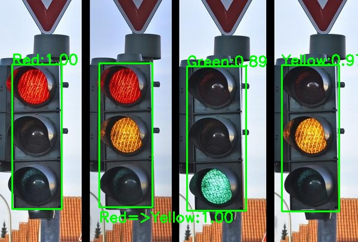

# Traffic Light Classifier
This repo is a simple module (**depends on the OpenCV package only**) to recognize the signal (red, yellow or green) of the traffic light. Most of the codes are from https://github.com/thedch/traffic-light-classifier, The modification is list at "Traffic_Light_Classifier.py".

## Dependency
- python 3
- opencv

## Installation
To prepare the environment, it needs to install the dependent packages as listed above. We use [conda](https://docs.conda.io/en/latest/miniconda.html) to create one example:
```bash
conda create --name traffic_light python=3.5 -y
conda activate traffic_light
pip install opencv-python
```
## Quick start
In the required python environment, clone the repo, and run the 'demo.py'.
```bash
git clone https://github.com/WangLiwen1994/traffic_light.git
cd traffic_light

python demo.py
```
You can see the result displayed by a window like: text denotes the color of the traffic light, the value is the confidence score (probability).




## To use the module
just copy "Traffic_Light_Classifier.py" and "demo.py"(change another name) to your project.
```python
from demo import TrafficLight

m_light = TrafficLight(position=[xL, yT, xR, yB]) # set the position of the traffic light

signal, prob = m_light.getSignal(img_bgr) # input the opencv image with the format of "BGR"
# "signal" stores the text of the signal name,
# "prob" stores the probability of the prediction. 


```